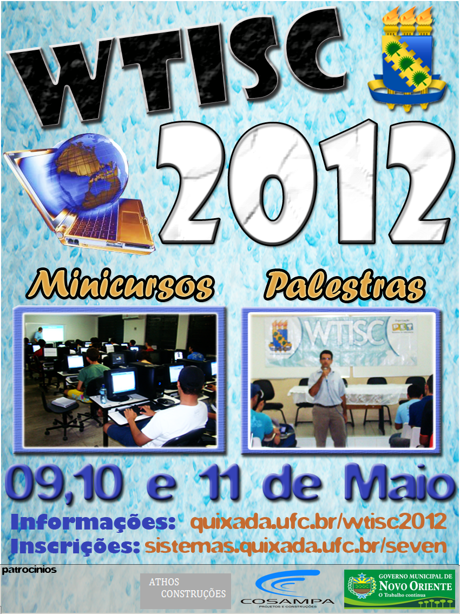
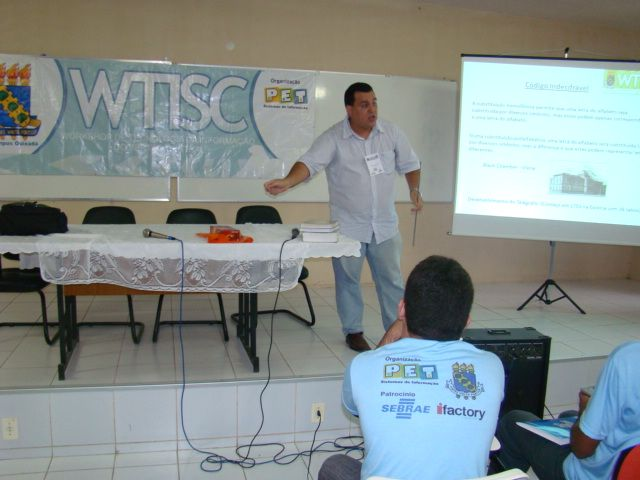
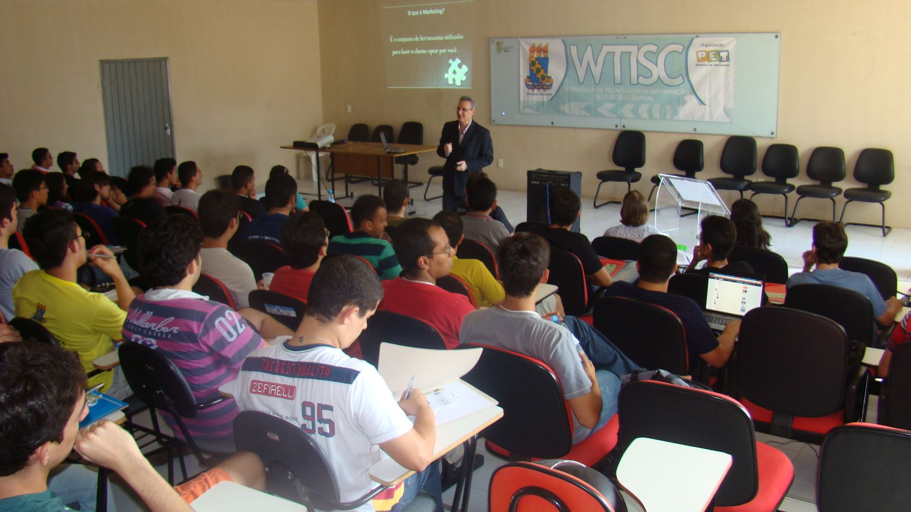
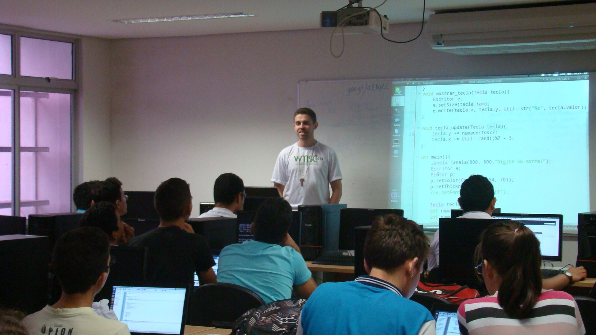
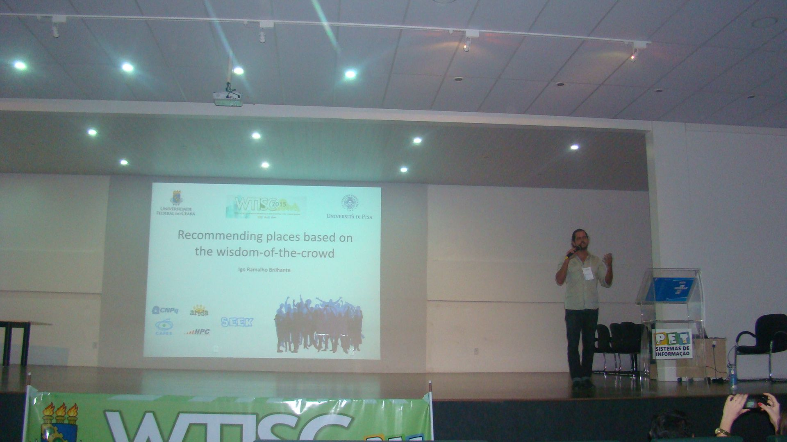

# Workshop de Tecnologia da Informação do Sertão Central

Workshop de Tecnologia da Informação do Sertão Central (WTISC) é um evento da Universidade Federal do Ceará Campus Quixadá, realizado anualmente pelos bolsistas do Programa de Educação Tutorial do cursos de Sistemas de Informação(PET – SI). O WTISC é evento público realizado desde 2008, e consiste na oferta de palestras e minicursos. Buscando apresentar aos alunos/participantes um pouco da realidade do mercado de trabalho.

O objetivo do evento é promover e difundir o conhecimento sobre as diversas áreas de Tecnologia da Informação, de forma a fortalecer e motivar a formação técnico-profissional, por meio da troca de experiências entre profissionais e acadêmicos.

Nas palestras, os profissionais contam sua experiência profissional e temas acadêmicos: área de atuação, dicas para se tornar um bom profissional, tecnologias utilizadas, além de diversos temas tecnológicos.

Nos minicursos, são apresentados aos alunos/participantes várias técnicas e ferramentas utilizadas em diversas áreas de atuação no mercado e na academia.
<figure>

<figcaption>Cartaz WTISC 2012</figcaption>
</figure>

<figure>

<figcaption>Palestra WTISC 2011 com o professor Gabriel Paillard</figcaption>
</figure>

<figure>

<figcaption>Palestra WTISC 2012 </figcaption>
</figure>

<figure>

<figcaption>Minicurso WTISC 2014 com o professor David Sena </figcaption>
</figure>

<figure>

<figcaption>Palestra WTISC 2015 com o Igo Ramalho Brilhante </figcaption>
</figure>

